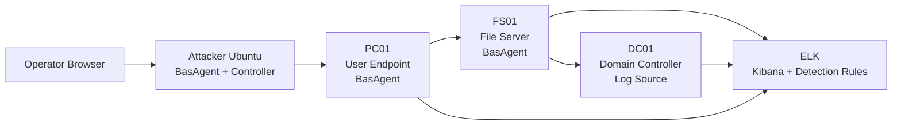

# SB-AD BAS Dashboard Enhancement Plan

## 1. 목적

이 문서는 5주차 2회차 멘토링 피드백을 반영해 Spacebar BAS 대시보드를 어떻게 고도화할지 정리한 개발 방향 문서다.

현재 Spacebar BAS는 `공격 시뮬레이터 + ELK 탐지 검증 대시보드`에 가깝다. 이것은 현재 프로젝트 단계에서는 적절한 MVP다. 다만 멘토님이 지적한 것처럼 상용 BAS에 가까워지려면 단순히 Technique 실행 버튼을 제공하는 수준을 넘어, 다음 요소를 연결해서 보여줘야 한다.

- 기업 환경의 자산과 네트워크 구간
- 각 자산에 설치된 BasAgent와 로그 수집기
- 구간별 보안 통제와 탐지 룰
- 공격 흐름과 Technique 실행 순서
- 원본 로그 수집 여부
- ELK/Kibana 탐지 룰 작동 여부
- 미탐 구간과 보완 백로그
- 보고서화 가능한 실행 증거

따라서 목표는 “공격을 실행했다”가 아니라 “이 기업 환경에서 이 공격이 어디까지 도달했고, 어떤 보안 통제가 이를 탐지했으며, 어떤 구간이 비어 있는지”를 보여주는 것이다.

## 2. 멘토링 피드백 반영

5주차 2회차 멘토링에서 받은 핵심 피드백은 다음과 같다.

| 피드백 | 의미 | BAS 적용 방향 |
| --- | --- | --- |
| 현재 구현물은 BAS 전체라기보다 공격 시뮬레이터에 가깝다 | 공격 실행만으로는 BAS라고 보기 어렵다 | 탐지 검증, 자산, 보안 통제, 보고서까지 연결 |
| BAS는 보안 장비를 테스트하기 위한 훈련 장비다 | 공격 성공 여부보다 보안 솔루션의 탐지/차단 여부가 중요하다 | `source log`, `alert`, `missed`, `blocked` 상태를 분리 |
| BAS는 에이전트가 필요하다 | 공격 시작점과 도착점에서 페이로드 도달 여부를 확인해야 한다 | PC01, FS01, Attacker BasAgent 상태를 UI에 노출 |
| 네트워크 구간 단위로 테스트해야 한다 | 모든 호스트 조합이 아니라 대표 구간별 검증이 중요하다 | 네트워크 맵과 edge 기반 검증 결과 표시 |
| 자산 정보와 보안 솔루션 정보가 있어야 한다 | 무엇을 대상으로 무엇을 검증하는지 명확해야 한다 | Asset / Segment / Security Control 모델 추가 |
| 플레이북은 Technique ID보다 행위 기반이 좋다 | 실무 질문은 “T1059 찾기”보다 “PowerShell 원격 실행 흔적 찾기”에 가깝다 | Technique과 함께 Behavior 이름을 1급 정보로 표시 |

## 3. 현재 UI 상태

현재 대시보드에는 다음 기능이 이미 있다.

- 캠페인 선택
- API 연결 상태 표시
- 캠페인별 Score / Detection / Gap 요약
- Technique Library
- 실행 Queue
- Agent 기반 Job 생성
- Job / Run 목록
- 실행 결과 상세
- 명령 실행 결과와 ELK 근거 표시
- HTML 보고서 목업 링크

즉 실행과 결과 확인의 골격은 이미 있다. 부족한 부분은 “기업 환경 전체를 검증한다”는 관점이다.

현재 UI는 아래 흐름에 가깝다.

```text
Campaign 선택
  -> Technique 선택
  -> Queue 실행
  -> Run 결과 확인
  -> ELK 근거 확인
```

고도화 후 목표 흐름은 아래처럼 바꾼다.

```text
기업 환경 선택
  -> 자산/망/보안통제 확인
  -> 공격 경로 선택
  -> Technique 실행
  -> Agent별 실행 상태 확인
  -> 로그 수집 여부 확인
  -> Kibana 탐지 룰 작동 여부 확인
  -> 미탐 구간과 보완점 도출
  -> 보고서 생성
```

## 4. 제안하는 대시보드 구조

### 4.1 Overview

현재 요약 화면은 유지하되, 점수를 단순 탐지율 하나로 끝내지 않고 보안 검증 지표로 확장한다.

추가할 지표:

- Overall Validation Score
- Technique 실행률
- Source Log 수집률
- Alert 생성률
- 미탐 Gap 수
- 고위험 Technique 미탐 수
- Agent Online 수
- 최근 실행 대비 개선/퇴보

표시 예시:

```text
Overall Score: 72
Execution: 12 / 12
Source Logs: 10 / 12
Alerts: 8 / 12
Detection Gaps: 4
Critical Missed: 1
Agents Online: 3 / 3
```

### 4.2 Environment Map

상용 BAS 느낌을 가장 크게 살리는 화면이다. 기업 환경의 네트워크 망과 자산을 다이어그램으로 표시한다.

초기 SB-AD 모델:



각 노드에 표시할 정보:

- Hostname
- Role
- IP
- OS
- Agent 상태
- 로그 수집기 상태
- 주요 보안 통제
- 관련 Technique 수
- 최근 탐지/미탐 카운트

각 edge에 표시할 정보:

- 통신 방향
- 프로토콜/포트
- 관련 Technique
- 예상 보안 통제
- 마지막 검증 결과

예시 edge:

| Edge | Protocol | Technique | Expected Control |
| --- | --- | --- | --- |
| PC01 -> FS01 | WinRM 5985 | T1021.006, T1059.001 | Sysmon, Winlogbeat, Kibana Rule |
| FS01 -> Attacker | HTTP 8080 | T1041 | Sysmon Event 3, Windows 5156, Kibana Rule |
| Attacker -> DC01 | DRSUAPI/SMB | T1003.006 | DC Security 4662, Kibana Rule |

### 4.3 Attack Path Map

Pentera Attack Map처럼 공격 흐름을 노드와 선으로 표현한다.

각 공격 단계 카드에 표시할 정보:

- Scenario order
- Behavior name
- MITRE Technique
- Source asset
- Destination asset
- Risk
- Execution status
- Source log status
- Alert status
- Report include toggle

예시:

```text
10. WinRM Remote Execution
PC01 -> FS01
T1021.006 / High
Execution: simulated or success
Source log: matched
Alert: detected
```

상태 색상:

- 회색: 미실행
- 파랑: 실행됨, 로그 확인 전
- 초록: alert 탐지됨
- 노랑: source log만 확인됨
- 빨강: 실행됐지만 로그/alert 미확인
- 보라: 민감 단계, 안전 게이트 필요

### 4.4 Security Controls View

Cymulate식 보안 통제 관점 화면이다. “어떤 보안장비가 어떤 공격을 커버했는가”를 보여준다.

SB-AD에서의 보안 통제 후보:

| Control | Role | Current Evidence |
| --- | --- | --- |
| Sysmon | 프로세스, 네트워크, 파일, LSASS 접근 이벤트 | Event ID 1, 3, 10, 11 |
| Windows Security Log | 로그인, DCSync, 네트워크 허용 이벤트 | 4624, 4662, 4769, 5156 |
| PowerShell Script Block Logging | 도구 다운로드, PowerShell 명령 흔적 | 4104 |
| Winlogbeat/Filebeat | Windows 로그 ELK 전송 | `winlogbeat-*`, `logs-*` |
| Kibana Detection Rule | 탐지 룰 alert 생성 | `.alerts-security.alerts-default` |
| Windows Defender | 사전 차단/우회 확인 | 후속 확장 |
| AWS Security Group | 공격자 서버 접근 경로 제어 | 80, 443, 8080 등 |

화면 구성:

- 보안 통제별 카드
- 각 카드에 covered / logged / alerted / missed 수치 표시
- 클릭 시 해당 보안 통제가 커버한 Technique 목록 표시
- 미탐 룰은 Remediation Backlog로 연결

### 4.5 Agent and Asset Manager

BasAgent를 단순 내부 정보가 아니라 UI에서 관리 대상으로 보여준다.

표시 항목:

- Agent ID
- Host
- Role
- Campaign
- Execution mode
- Status
- Last heartbeat
- Capabilities
- Assigned techniques
- 실행 가능한 명령 타입

예시:

| Agent | Host | Role | Status | Capabilities | Assigned |
| --- | --- | --- | --- | --- | --- |
| `sbad-pc01-bas-agent` | PC01 | pc01 | Online | windows, powershell, winrm | 2, 3, 4, 5, 6, 10, 11, 12, 15, 16 |
| `sbad-fs01-bas-agent` | FS01 | fs01 | Online | windows, powershell, sysmon | 13 |
| `sbad-attacker-bas-agent` | Attacker | attacker | Online | linux, impacket | 19 |

초기에는 읽기 전용으로 충분하다. 나중에 자산 추가 UI를 만든다.

### 4.6 Live Run Timeline

공격 실행 중 “지금 어디까지 진행됐는지”를 시간 순서로 보여준다.

단계별 표시:

```text
13:10:01  PC01 Agent received job
13:10:04  T1021.006 command executed
13:10:19  FS01 Sysmon Event 1 matched
13:10:42  Kibana alert 10.T1021.006 generated
13:11:02  Step marked detected
```

상용 BAS 느낌을 내려면 이 화면이 중요하다. 사용자가 “공격이 흐르는 장면”을 볼 수 있기 때문이다.

### 4.7 Evidence and Detection Detail

현재 증거 패널은 좋은 출발점이다. 여기에 `source log`와 `alert`를 더 분리해서 보여준다.

권장 상태 분류:

| Status | Meaning |
| --- | --- |
| `executed` | 명령 실행 또는 시뮬레이션 완료 |
| `source_log_matched` | 원본 로그는 확인됨 |
| `alert_detected` | Kibana Detection Rule alert 확인됨 |
| `logged_but_not_alerted` | 로그는 있으나 탐지 룰이 alert를 만들지 못함 |
| `not_logged` | 실행했지만 기대 로그가 없음 |
| `blocked` | 보안 통제가 실행을 차단함 |
| `not_tested` | 아직 검증하지 않음 |

이 분류가 있어야 보고서에서 “보안장비가 못 막았다”와 “로그는 있는데 탐지 룰이 약하다”를 구분할 수 있다.

### 4.8 Remediation Backlog

실무형 결과물로 가장 중요한 화면이다. BAS 실행 후 바로 개선 작업 목록으로 이어져야 한다.

필드:

- Priority
- Technique
- Behavior
- Asset / Edge
- Finding
- Evidence
- Recommended fix
- Owner
- Status
- Retest date

예시:

| Priority | Finding | Recommended Fix |
| --- | --- | --- |
| P1 | T1003.006 DCSync source log exists but alert missing | DC01 4662 Properties GUID 기반 룰 활성화 |
| P2 | T1041 external HTTP exfil hardcoded port dependency | 외부망 목적지 + PowerShell/cmd 프로세스 기반 룰로 일반화 |
| P2 | T1105 only script block log checked | Sysmon 3/11 보조 증거 추가 |

## 5. 데이터 모델 확장안

### 5.1 `targets/SB-AD.yaml`

현재 `hosts`, `capabilities`, `elk`, `log_queries`는 잘 잡혀 있다. 여기에 UI용 구조를 추가한다.

권장 추가 필드:

```yaml
segments:
  - id: user-subnet
    name: User Endpoint Subnet
    cidr: 10.0.4.0/24
  - id: server-subnet
    name: Server Subnet
    cidr: 10.0.10.0/24
  - id: domain-subnet
    name: Domain Controller Subnet
    cidr: 10.0.13.0/24
  - id: attacker-subnet
    name: Attacker Subnet
    cidr: 10.0.1.0/24

assets:
  - id: pc01
    hostname: PC01.mycompany.local
    role: user_endpoint
    segment: user-subnet
    agent_id: sbad-pc01-bas-agent
    controls: [sysmon, winlogbeat, powershell_logging, kibana_rules]
  - id: fs01
    hostname: FS01.mycompany.local
    role: file_server
    segment: server-subnet
    agent_id: sbad-fs01-bas-agent
    controls: [sysmon, winlogbeat, powershell_logging, kibana_rules]
  - id: dc01
    hostname: DC01.mycompany.local
    role: domain_controller
    segment: domain-subnet
    controls: [windows_security_log, winlogbeat, kibana_rules]
  - id: attacker
    hostname: Attacker Ubuntu
    role: attacker_infra
    segment: attacker-subnet
    agent_id: sbad-attacker-bas-agent
    controls: [aws_security_group]

links:
  - id: pc01-fs01-winrm
    source: pc01
    destination: fs01
    protocol: WinRM
    port: 5985
    techniques: [T1021.006, T1059.001]
    controls: [sysmon, windows_security_log, kibana_rules]
  - id: fs01-attacker-http
    source: fs01
    destination: attacker
    protocol: HTTP
    port: 8080
    techniques: [T1041]
    controls: [sysmon, windows_filtering_platform, kibana_rules]
```

### 5.2 `campaigns/SB-AD.yaml`

각 step에 UI용 경로 정보를 추가한다.

```yaml
ui:
  source_asset: pc01
  destination_asset: fs01
  path_stage: lateral_movement
  expected_controls:
    - sysmon
    - winlogbeat
    - kibana_rules
  expected_logs:
    - Sysmon Event ID 1
    - Windows Security 4624
  expected_alert_rule: 10.T1021.006
```

이렇게 하면 화면에서 Technique을 단순 리스트가 아니라 공격 경로 위에 표시할 수 있다.

### 5.3 Run Result

실행 결과 JSON에도 다음 필드를 추가한다.

```json
{
  "asset_path": ["pc01", "fs01"],
  "control_results": [
    {
      "control_id": "sysmon",
      "status": "source_log_matched",
      "evidence": "Sysmon Event ID 1 wsmprovhost.exe"
    },
    {
      "control_id": "kibana_rules",
      "status": "alert_detected",
      "rule_name": "10.T1021.006"
    }
  ],
  "finding_status": "detected"
}
```

## 6. 개발 단계

### Phase 1. Static Environment Map

목표:

- `targets/SB-AD.yaml`의 hosts 정보를 기반으로 PC01, FS01, DC01, Attacker, ELK를 화면에 표시한다.
- 실제 편집 기능은 넣지 않는다.
- 노드 클릭 시 IP, role, agent, log source, controls를 보여준다.

수정 파일:

- `targets/SB-AD.yaml`
- `frontend/src/App.jsx`
- `frontend/src/styles.css`

완료 기준:

- 대시보드에 `Environment Map` 탭이 생긴다.
- SB-AD 자산이 네트워크 다이어그램으로 보인다.

### Phase 2. Attack Path Map

목표:

- `campaigns/SB-AD.yaml`의 flow를 공격 경로 그래프로 표시한다.
- 각 노드는 Technique 실행 단계, 각 edge는 자산 간 이동을 의미한다.
- 노드 색상은 run 결과에 따라 바뀐다.

완료 기준:

- T1021.006, T1059.001, T1105, T1003.001, T1041, T1003.006 흐름이 시각적으로 연결된다.
- 클릭 시 기존 evidence 패널로 이동한다.

### Phase 3. Security Controls Coverage

목표:

- Sysmon, Windows Security, PowerShell Logging, Kibana Rule을 보안 통제로 모델링한다.
- Technique별로 어떤 통제가 source log를 남겼고, 어떤 통제가 alert를 냈는지 분리한다.

완료 기준:

- `logged but not alerted` 상태를 표현할 수 있다.
- 미탐 항목이 Remediation Backlog로 이어진다.

### Phase 4. Agent and Asset Manager

목표:

- `/agents` API 결과를 자산 맵에 연결한다.
- Online/Offline/Heartbeat 상태를 노드에 표시한다.
- 나중에 자산 추가 UI로 확장할 수 있도록 모델을 고정한다.

완료 기준:

- PC01/FS01/Attacker Agent 상태가 대시보드에서 바로 보인다.
- Queue 실행 버튼이 어떤 Agent로 가는지 명확히 보인다.

### Phase 5. Report Integration

목표:

- 공격 경로, 탐지 결과, 보완 백로그를 HTML 보고서에 반영한다.
- 보고서는 캠페인 설명이 아니라 특정 Run의 결과물로 연결한다.

완료 기준:

- Run detail에서 `HTML 보고서 보기`를 눌렀을 때 공격 경로와 control coverage가 포함된다.

## 7. UI 패턴 결정

대시보드는 SaaS 보안 운영 도구처럼 조용하고 스캔하기 쉬워야 한다. 마케팅 페이지처럼 큰 히어로나 장식적인 카드 중심 구성은 피한다.

권장 패턴:

- 상단: 캠페인/환경/agent 상태 요약
- 좌측: 환경 자산 또는 캠페인 목록
- 중앙: 네트워크 맵 또는 공격 경로 맵
- 우측: 선택한 노드/Technique 상세 패널
- 하단: 실행 타임라인과 evidence table

버튼/컨트롤:

- Technique 실행: 명확한 primary button
- 노드 상세: side panel
- MITRE/Control 필터: segmented control
- 상태: badge/chip
- 위험도: 색상 badge
- 보고서 추가: icon + text button

색상 원칙:

- 배경은 현재처럼 밝은 회색/흰색 기반 유지
- 상태 색상만 강하게 사용
- 초록: detected
- 노랑: logged only
- 빨강: missed
- 파랑: running
- 회색: not tested

## 8. 실무적으로 얻는 기술

이 방향으로 고도화하면 단순히 UI가 예뻐지는 것보다 다음 기술을 얻을 수 있다.

- 자산과 네트워크 구간을 보안 검증 모델로 표현하는 능력
- 공격 Technique을 실제 자산 간 흐름으로 매핑하는 능력
- 탐지 룰을 source log와 alert로 분리해 검증하는 능력
- Agent 기반 실행 결과를 중앙 대시보드로 모으는 능력
- 미탐 원인을 detection engineering backlog로 전환하는 능력
- BAS 결과를 보고서와 발표 자료로 연결하는 능력

즉 최종 포지션은 다음처럼 설명할 수 있다.

```text
Spacebar BAS는 MITRE ATT&CK 기반 공격 시나리오를 실행하고,
기업형 AD 환경의 자산/구간/보안통제별 탐지 유효성을 검증하는
Detection Validation Dashboard다.
```

## 9. 오늘 기준 추천 우선순위

오늘 바로 개발한다면 아래 순서가 가장 현실적이다.

1. `Environment Map` 탭 추가
2. `targets/SB-AD.yaml`에 assets / segments / links / controls 추가
3. SB-AD 자산 노드 표시
4. 노드 클릭 시 host / agent / log source / controls 표시
5. Technique flow에 source_asset / destination_asset 연결
6. Run 결과를 노드/edge 색상에 반영

처음부터 자산 추가 편집 UI까지 만들 필요는 없다. 우선 YAML 기반 읽기 전용 맵을 만들고, 그 다음 편집 기능으로 확장하는 것이 안전하다.
