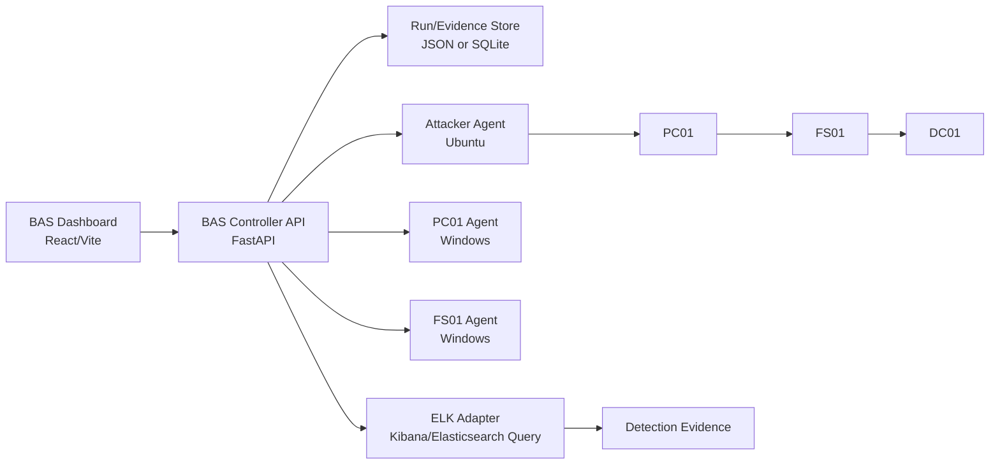

# SB-AD BAS 대시보드·에이전트·콘솔 구축 명세서

## 1. 제품 정의

Spacebar BAS는 상용 BAS 전체를 그대로 복제하는 도구가 아니라, 현재 프로젝트 범위에 맞춘 **AD 환경 공격 시뮬레이션 및 ELK 탐지 검증 콘솔**이다.

목표는 공격 도구를 실행하는 것 자체가 아니라, 특정 TTPs를 실행했을 때 다음 질문에 답하는 것이다.

- 어떤 자산에서 어떤 테크닉이 실행되었는가
- 공격 흐름이 어떤 네트워크 구간을 통과했는가
- ELK/Kibana 탐지룰이 해당 행위를 관찰하고 경보화했는가
- 미탐 또는 로그 부족이 발생했다면 어떤 룰·로그·에이전트 설정을 보완해야 하는가
- 실행 결과를 보고서 형태로 남길 수 있는가

## 2. 구현 범위

### MVP 범위

- SB-AD 캠페인 기준 자산 맵 제공
- Technique 단위 실행 큐 구성
- Controller가 Agent에 작업을 전달하는 구조
- PC01, FS01, Attacker Ubuntu 에이전트 등록 상태 표시
- 실행 결과를 Run 단위로 저장
- ELK/Kibana 탐지 결과를 Evidence로 연결
- HTML 결과 보고서 목업 또는 초안 생성

### 고도화 범위

- 에이전트별 실시간 상태, 마지막 heartbeat, OS, IP, 역할 표시
- 자산 간 공격 흐름 애니메이션
- 네트워크 구간별 검증 결과 표시
- ELK 탐지룰 커버리지, 미탐 목록, 보완 backlog 제공
- PDF 내보내기를 고려한 HTML 보고서 템플릿 정리

## 3. 전체 아키텍처

## 4. 주요 컴포넌트

### 4.1 Dashboard

역할:

- 캠페인 선택
- 자산 및 에이전트 상태 확인
- Technique 선택 및 실행 큐 구성
- Run 실행 및 진행 상태 확인
- 자산 맵에서 공격 흐름 시각화
- ELK 탐지 결과 확인
- HTML 보고서 보기

필수 화면:

- `요약`: 캠페인, 자산 수, 에이전트 상태, 큐 개수, 실행 이력, ELK 설정 상태
- `테크닉`: 캠페인에 포함된 Technique 검색·필터·전체 선택
- `실행 큐`: 실행 순서, 파라미터, 순서 변경, 제거, 실행
- `탐지 증거`: Run 결과, ELK 탐지 여부, KQL, 관련 로그, 보완 필요 사항
- `자산 맵`: PC01, FS01, DC01, Attacker, ELK 간 공격 흐름과 탐지 상태 표시

### 4.2 Controller API

역할:

- 캠페인/테크닉 정의 로드
- 에이전트 등록 및 heartbeat 수신
- 실행 큐를 Agent 작업으로 변환
- Run 상태 저장
- ELK 질의 수행 및 탐지 결과 연결
- 보고서 생성 데이터 제공

핵심 API 후보:

- `GET /campaigns`
- `GET /campaigns/{id}`
- `GET /agents`
- `POST /agents/register`
- `POST /agents/{id}/heartbeat`
- `POST /runs`
- `GET /runs/{execution_id}`
- `POST /runs/{execution_id}/verify`
- `GET /runs/{execution_id}/report`

### 4.3 Agent

공통 역할:

- Controller에 자신을 등록
- 주기적으로 heartbeat 전송
- 자신에게 배정된 technique 작업 수신
- 명령 실행 전 안전 조건 확인
- 실행 결과, stdout/stderr, exit code, 시작/종료 시각 전송

설치 대상:

- `PC01 Agent`: 사용자 행위, PowerShell/WinRM 기반 행위, PC01에서 시작되는 lateral movement 검증
- `FS01 Agent`: FS01 내부에서 직접 발생하는 행위 검증, LSASS dump 같은 서버 로컬 실행 검증
- `Attacker Ubuntu Agent`: 공격자 서버 측 파일 서버, 업로드 서버, Impacket 계열 실행, 외부 C2/전송 흐름 검증

권장 구현:

- MVP: Python 기반 polling agent
- Windows: Python + PowerShell subprocess 실행
- Ubuntu: Python + shell subprocess 실행
- 패키징: 추후 PyInstaller 또는 Windows service wrapper 적용

안전 제약:

- technique allowlist 기반 실행
- destructive command 금지
- 기본 timeout 적용
- 실행 전 target asset 검증
- stdout/stderr 길이 제한
- 자격 증명과 키는 코드에 저장하지 않음
- 실습 환경 외부 IP 또는 경로는 별도 승인 없이는 실행하지 않음

## 5. 데이터 모델

### Asset

- `asset_id`
- `hostname`
- `ip`
- `os`
- `segment`
- `role`
- `security_controls`
- `agent_id`

### Agent

- `agent_id`
- `asset_id`
- `status`
- `last_seen`
- `version`
- `capabilities`

### Technique

- `technique_id`
- `order`
- `name`
- `asset_id`
- `executor_agent_id`
- `phase`
- `command_template`
- `inputs`
- `expected_logs`
- `expected_detection_rules`

### Run

- `execution_id`
- `campaign_id`
- `started_at`
- `ended_at`
- `status`
- `steps`
- `coverage_summary`

### Evidence

- `step_id`
- `technique_id`
- `asset_id`
- `elk_status`
- `rule_name`
- `kql`
- `event_count`
- `sample_events`
- `verdict`
- `remediation`

## 6. ELK 탐지 검증 방식

ELK 연동은 “공격을 막았다”가 아니라 **로그 기반 탐지 체계가 해당 행위를 관찰하고 경보화했는지**를 검증하는 방식으로 표현한다.

검증 단계:

1. Technique 실행 시작 시각 기록
2. 실행 종료 시각 기록
3. Technique별 KQL 또는 Detection Rule ID 확인
4. 실행 시간 범위 + lookback 기준으로 Elasticsearch/Kibana 질의
5. 이벤트 존재 여부, Alert 존재 여부, 관련 필드 확인
6. 결과를 `detected`, `logged_only`, `missed`, `not_applicable`로 분류

판정 기준:

- `detected`: Security alert 또는 지정 탐지룰에 매칭됨
- `logged_only`: 원본 로그는 있으나 alert는 없음
- `missed`: 기대 로그와 alert 모두 확인되지 않음
- `not_applicable`: 현재 환경에서 검증 제외

## 7. UI 구현 방향

### 자산 맵

- Attacker, PC01, FS01, DC01, ELK를 노드로 표시
- 네트워크 구간을 영역으로 분리
- Technique 실행 시 해당 노드와 경로를 강조
- 탐지 성공 시 ELK 노드 또는 경로에 탐지 표시

### 실행 흐름

- 실행 큐는 조작 패널이므로 컴팩트해야 함
- Run 실행 버튼은 기본 높이 32~36px 수준 유지
- 선택된 Technique는 순서, 자산, 역할, 입력값만 빠르게 확인 가능해야 함

### 탐지 증거

- Technique별 탐지 상태
- KQL
- Rule name
- Event count
- 주요 필드
- 보완 필요 여부

### 보고서

- 실행 개요
- 자산 범위
- Technique coverage
- 탐지/미탐 요약
- MITRE heatmap
- Evidence table
- Remediation backlog

## 8. 필요한 Codex/MCP 도구

현재 로컬 개발에 필요한 도구는 이미 사용 가능하다.

- Browser: 로컬 대시보드 캡처, 클릭 검증, 콘솔 오류 확인
- Build Web Apps: React/Vite UI 수정 및 검증
- GitHub: 브랜치 확인, 커밋, push, PR 작업
- Notion: 필요한 경우 멘토링/테크닉 문서 정리
- Vercel: 배포 확인이 필요할 때 사용

추가 MCP를 무작정 설치하기보다, 다음 구현 단계에서 실제로 필요한 런타임 의존성을 코드 기준으로 확정한다.

예상 의존성:

- Python agent: `requests`, `pyyaml`
- Controller: `fastapi`, `uvicorn`, `pydantic`
- ELK 연동: `elasticsearch` Python client 또는 Kibana API 호출
- Windows 실행: PowerShell subprocess
- 패키징: PyInstaller 또는 Windows service wrapper

## 9. 다음 구현 체크리스트

- [ ] 왼쪽 콘솔 패널의 UI 밀도 안정화
- [ ] Agent 데이터 모델 확정
- [ ] Controller의 agent register/heartbeat API 추가
- [ ] Python polling agent MVP 작성
- [ ] PC01/FS01/Attacker별 capability 정의
- [ ] Technique별 executor agent 매핑
- [ ] Run 실행 시 agent 작업 큐 생성
- [ ] ELK 검증 결과를 step evidence에 연결
- [ ] 자산 맵에서 실행 경로와 탐지 상태 표시
- [ ] HTML 보고서에 coverage와 remediation backlog 반영

